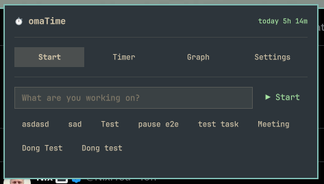
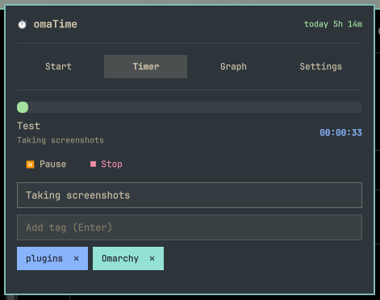
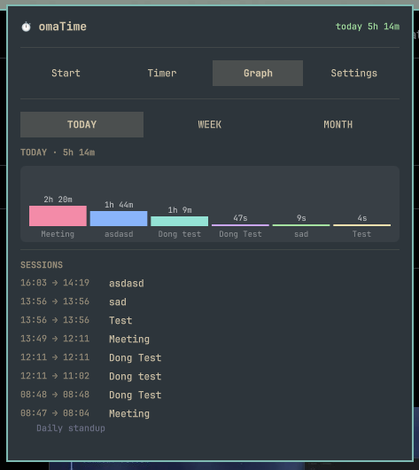
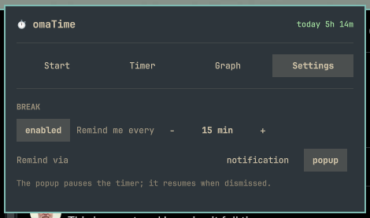

# omaTime for Omarchy

Manual, Timeular-style time tracking in the Omarchy bar. Start a task, stick a
note and tags on it, get break reminders, and review where your time actually
went — daily, weekly, or monthly.

## Features

- **Start / Stop / Pause** — manual per-task sessions with a live elapsed clock
  in the bar. Paused time is excluded from totals, graphs, and the session list.
- **Notes and tags** — annotate the running session; tags get colors and are
  remembered for reuse.
- **Break reminders** — a desktop notification after a configurable interval
  (default 50 min, nudgeable ±5 in the panel), or an intrusive dismissable
  popup that pauses the timer until you look away and come back.
- **Graphs** — TODAY / WEEK / MONTH per-day bar charts plus a per-task
  breakdown, so trends show up at a glance.
- **Private by design** — everything lives in a local SQLite database. No
  network, no telemetry, no accounts.

## Screenshots

| Start | Timer | Graph | Settings |
| --- | --- | --- | --- |
|  |  |  |  |

## Install

From the published repository:

```sh
omarchy plugin add https://github.com/iampoul/omatime.git --enable
```

### Install for development

Copy the plugin directory to the user plugin root so Omarchy can discover it:

```sh
cp -a omatime ~/.config/omarchy/plugins/io.github.iampoul.omatime

omarchy-shell shell rescanPlugins
omarchy plugin enable io.github.iampoul.omatime
```

## Use

Click the bar pill to open the panel:

1. **Start** — type a task name (existing tasks autocomplete) and hit Enter or
   **▶ Start**. If a session is already running you'll be asked to confirm the
   switch before it is stopped.
2. **Timer** — the running card shows elapsed time, a start-time clock, manual
   **Pause/Resume** and **Stop**, and the next-break countdown. Edit the note
   and tags inline.
3. **Graph** — toggle TODAY / WEEK / MONTH to see the period total, a per-day
   bar chart, the per-task breakdown, and the session list.
4. **Settings** — enable/disable break reminders, change the interval, and pick
   the reminder style (notification or popup).

Remove with:

```sh
omarchy plugin remove io.github.iampoul.omatime
```

## Data, privacy, and dependencies

- Sessions, notes, tags, and break settings are stored in
  `~/.local/share/omatime/omatime.db` (SQLite). The database directory is
  created mode `0700` and the file mode `0600` (owner-only), regardless of
  umask, so other local users cannot read tracked task names or session notes.
  Removing the plugin or its manifest does not touch the data; delete the
  database to start fresh.
- The backend (`omatime-db.sh`) requires `sqlite3` and `jq`. Notifications use
  `omarchy-notification-send`, which ships with Omarchy.
- The plugin never overwrites Omarchy's `shell.json` or any user configuration.
  It only reads global break settings that it wrote itself.
- No network access, no telemetry, no accounts.

## Validation

```sh
omarchy plugin validate "$HOME/.config/omarchy/plugins/io.github.iampoul.omatime"
```

## License

MIT. See [LICENSE](LICENSE).